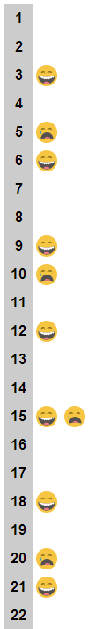

# Happy Sad

## Problem
Using HTML, CSS, and JavaScript please do the following.

Write a program that prints the numbers 1 to 100 within a gray block. However, for multiples of three also render the happy face image (`images/happy.png`) contained within a blue block. For multiples of five render the sad face image (`images/sad.png`) contained within a pink block. For multiples of **three** _and_ **five** output both next to the number.

Output example:

